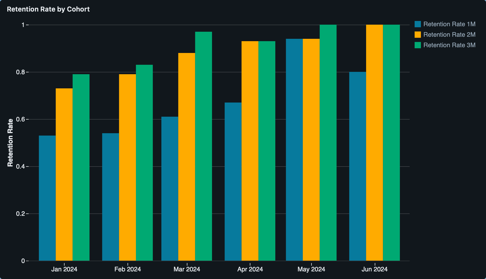

# Cohor Analysis / Customer Retention Analysis using Modern Data Stack

## Objective
The goal of this project is to gain a solid understanding of how the modern data stack works together — from data ingestion and transformation to visualization — and how cohort analysis can reveal insights into repeat purchase behavior.  

❗**Main Steps to Achieve This:**
- **Ingest** e-commerce sales data from a GCP Cloud SQL database using Fivetran.
- **Transform** and model the data with Databricks, leveraging Delta Lake.
- **Visualize** cohort trends (e.g., time to second purchase) in a Databricks Dashboard.

## Tools Used
- **Google Cloud SQL (BigQuery)**: The dataset `ecom_orders.csv` was uploaded to Google Cloud Storage, and then loaded into BigQuery using the BigQuery Console. The data was stored in a table within a dataset, allowing seamless querying and transformation.
  
- **Fivetran**: I configured Fivetran to connect to the BigQuery dataset containing the e-commerce sales data. Permissions were granted via IAM roles in Google Cloud to allow Fivetran to replicate the data into Databricks automatically. Fivetran then handled the data ingestion and synchronization from BigQuery into Databricks, ensuring the data was kept up to date.

- **Databricks**: I used Databricks for data transformation. After ingesting the raw e-commerce data into Databricks via Fivetran, I leveraged Delta Lake to clean, transform, and model the data. SQL was used to perform cohort analysis by calculating first and second purchase dates and time differences between them. Additionally, I used Databricks Dashboards to visualize key insights like retention rates and repeat purchases.

## Data Source
- **E-commerce Sales Data**: The dataset simulates a table `ecom_orders` containing transactional information, such as customer IDs, order dates, order IDs, and sales amounts. [Download the Sample Data](CSV_Files/ecom_orders.csv) (CSV file for loading into BigQuery)

## Results  
⚠️ Initially, I created the `cohort_analysis` table in Databricks, which included columns for `customer_id`, `first_purchase`, `second_purchase`, and the `days_between_1_and_2`. [This table](CSV_Files/cohort_analysis.csv) was used for further calculations and visualization in the dashboard.  
  
After completing the analysis, the following insights were revealed:
1. **Retention Rate by Cohort**: Analysis showed which cohort had the highest retention rates at 1, 2, and 3 months. [SQL Query used for this dashboard](SQL_Files/retention_rate_by_cohort.sql)
   
3. **Repeat Purchase Rate**: Trends in repeat purchases were visualized, highlighting second, third, and fourth purchases across cohorts.
4. **Cohort Size Analysis**: Cohort sizes were plotted to track the number of new customers per cohort over time.

These visualizations provide valuable insights into customer behavior, which can help businesses optimize their marketing strategies and improve customer retention.
